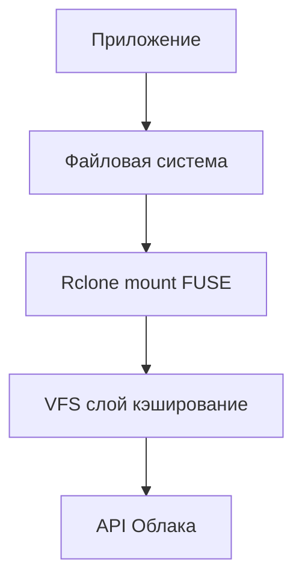

# 🚀 Быстрый старт с Rclone Manager

**Пошаговая настройка за 5 минут.**

---

## 🔄 Как работает rclone mount



**Пояснение:**
1. **Приложение** работает с файлами как с обычными
2. **Файловая система** - виртуальная директория в /mnt/
3. **Rclone mount** - мост между файловой системой и облаком
4. **VFS слой** - кэширует данные для производительности
5. **API Облака** - реальное хранилище данных

---

## Шаг 0: Предварительные требования

### Проверка установки rclone
```bash
rclone version
```

Если rclone не установлен:
```bash
curl https://rclone.org/install.sh | sudo bash
```

### Проверка systemd
```bash
systemctl --version
```

---

## Шаг 1: Установка Rclone Manager

### Вариант A: Автоматическая установка (рекомендуется)
```bash
# Перейдите в папку проекта
cd ~/projects/rclone-manager

# Запустите установку от имени root
sudo ./install.sh
```

**Что делает install.sh:**
- ✅ Устанавливает скрипт в `/usr/local/bin/rclone_manager.sh`
- ✅ Копирует шаблоны systemd сервисов
- ✅ Создает необходимые директории
- ✅ Добавляет алиасы в `~/.bashrc`
- ✅ Перезагружает systemd

### Вариант B: Ручная установка
```bash
# 1. Создать директории
mkdir -p ~/.config/systemd/user
mkdir -p ~/mnt/yandex_disk
mkdir -p ~/mnt/mail_ru
mkdir -p ~/mnt/google_drive

# 2. Скопировать файлы
cp rclone_manager.sh /usr/local/bin/
chmod +x /usr/local/bin/rclone_manager.sh
cp rclone@-ro.service ~/.config/systemd/user/
cp rclone@-rw.service ~/.config/systemd/user/

# 3. Перезагрузить systemd
systemctl --user daemon-reload

# 4. Добавить алиасы в ~/.bashrc
echo "
# Rclone Manager Aliases
alias rmro='rclone_manager.sh ro'
alias rmrw='rclone_manager.sh rw'
alias rmt='rclone_manager.sh toggle'
alias rms='rclone_manager.sh st'
" >> ~/.bashrc

# 5. Применить изменения
source ~/.bashrc
```

---

## Шаг 2: Настройка rclone

### Настройка Yandex Disk
```bash
rclone config
```

**Пошаговая инструкция:**
1. Нажмите `n` (создать новый remote)
2. Введите имя: `yandex_disk`
3. Выберите тип: `yandex` (номер в списке)
4. Client ID/Secret: оставьте пустым (Enter)
5. Согласитесь на открытие браузера
6. Авторизуйтесь в Яндекс Диске

### Настройка Mail.ru Cloud
```bash
rclone config
```

**Важно:** Для Mail.ru нужен пароль для внешних приложений!

1. Войдите в Mail.ru облако
2. Настройки → Безопасность → Пароли для внешних приложений
3. Создайте пароль (например, `rclone`)
4. Скопируйте его

**Пошаговая инструкция:**
1. Нажмите `n` (создать новый remote)
2. Введите имя: `mail_ru`
3. Выберите тип: `mailru`
4. Email: ваш email@mail.ru
5. Password: **пароль для внешних приложений** (не основной!)
6. speedup_enable: `false` (нажмите `n` или введите `false`)

### Настройка Google Drive
*(Для Google Drive рекомендуется использовать собственный API Client ID)*

1. Следуйте подробной инструкции: **[04c_Google_Drive.md](04c_Google_Drive.md)**

### Проверка конфигурации
```bash
# Проверить список облаков
rclone listremotes

# Проверить содержимое облаков
rclone lsd yandex_disk:
rclone lsd mail_ru:
rclone lsd google_drive:
```

---

## Шаг 3: Первое подключение

### Подключение всех облаков в безопасном режиме
```bash
# Подключить все облака в read-only
rmro

# Проверить статус
rms
```

**Ожидаемый вывод:**
```
Статус rclone облаков:

  ✓ yandex_disk: READ-ONLY
  ✓ mail_ru: READ-ONLY
  ✓ google_drive: READ-ONLY
```

### Проверка точек монтирования
```bash
# Проверить что файлы видны
ls ~/mnt/yandex_disk
ls ~/mnt/mail_ru
ls ~/mnt/google_drive

# Проверить что монтирование активно
findmnt --target ~/mnt/yandex_disk
```

---

## Шаг 4: Работа с файлами

### Безопасное чтение
```bash
# Просмотр файлов
ls -la ~/mnt/yandex_disk

# Копирование файлов (безопасно)
cp ~/mnt/yandex_disk/photo.jpg ~/Downloads/

# Чтение файлов
cat ~/mnt/yandex_disk/document.txt
```

### Редактирование файлов (с контролем)
```bash
# 1. Проверить текущий режим
rms yandex_disk

# 2. Переключить в режим записи (только если нужно)
rmt yandex_disk

# 3. Проверить что переключились
rms yandex_disk  # Должно показать READ-WRITE

# 4. Редактировать файлы
nano ~/mnt/yandex_disk/notes.txt

# 5. Немедленно вернуться в безопасный режим
rmt yandex_disk

# 6. Проверить возврат
rms yandex_disk  # Должно показать READ-ONLY
```

---

## Шаг 5: Базовые команды

**Все команды управления в [Команды.md](03_Команды.md).**

**Быстрый старт:**
```bash
rmro              # Все в read-only (безопасно)
rms               # Статус всех
rmstop            # Остановить все
```

**Для записи (используйте осторожно):**
```bash
rmrw              # Все в read-write (опасно!)
rmt               # Переключить режим всех
```

---

## 🎯 Быстрая проверка

### Проверка установки
```bash
# Должно работать
rclone_manager.sh st

# Должно показать алиасы
alias | grep rm
```

### Проверка безопасности
```bash
# 1. Подключить в безопасном режиме
rmro

# 2. Попробовать удалить файл (должно быть отказано)
touch ~/mnt/yandex_disk/test.txt
rm ~/mnt/yandex_disk/test.txt
# Ожидается: "Permission denied"

# 3. Попробовать создать файл (должно быть отказано)
echo "test" > ~/mnt/yandex_disk/test.txt
# Ожидается: "Permission denied"
```

---

## 🚨 Что делать если что-то пошло не так?

### Проблема: rclone не установлен
```bash
# Установите rclone
curl https://rclone.org/install.sh | sudo bash
```

### Проблема: "Permission denied" при монтировании
```bash
# Проверьте /etc/fuse.conf
sudo nano /etc/fuse.conf
# Должна быть строка: user_allow_other
```

### Проблема: Файлы не видны после запуска
```bash
# Подождите 2-3 секунды
sleep 3
ls ~/mnt/yandex_disk

# Проверьте логи
tail -f ~/.cache/rclone/rclone-yandex_disk-ro.log
```

### Проблема: Ошибка аутентификации
```bash
# Проверьте конфигурацию
rclone config show

# Обновите токен
rclone config update yandex_disk
```

---

## 📋 Чек-лист успешного старта

- [ ] rclone установлен и работает
- [ ] Rclone Manager установлен
- [ ] Алиасы добавлены в ~/.bashrc
- [ ] Yandex Disk настроен
- [ ] Mail.ru Cloud настроен
- [ ] Google Drive настроен
- [ ] Первое подключение работает (`rmro && rms`)
- [ ] Файлы видны в `~/mnt/`
- [ ] Безопасность работает (отказано в записи в read-only)

---

## 🎓 Следующие шаги

После успешного старта:

1. **Изучите безопасность** → [Безопасность](02_Безопасность.md)
2. **Посмотрите примеры** → [Готовые сценарии](../examples/usage_examples.md)
3. **Изучите параметры** → [VFS параметры](06_VFS_Параметры.md)
4. **Команды управления** → [Команды](03_Команды.md)
5. **Системные сервисы** → [Системные сервисы](05_Системные_сервисы.md)

---

## 💡 Полезные советы

### Добавьте в ~/.bashrc для удобства
```bash
# Быстрый старт
alias start_safe='rmro && rms && echo "✅ Безопасный режим активен"'

# Быстрая проверка
alias check_status='rms && echo "Проверьте режим перед операцией!"'

# Экстренная остановка
alias emergency_stop='rmstop && echo "🚨 Все облака остановлены"'
```

### Используйте историю команд
```bash
# Последние использованные команды
history | grep rm

# Повторить последнюю команду rm
!!
```

---

**Готово! Теперь вы можете безопасно работать с облачными дисками.** 🎉

**Главное правило:** Всегда проверяйте статус перед операциями! (`rms`)