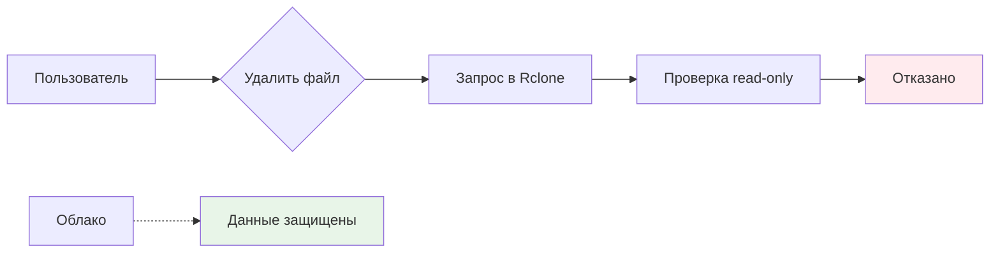
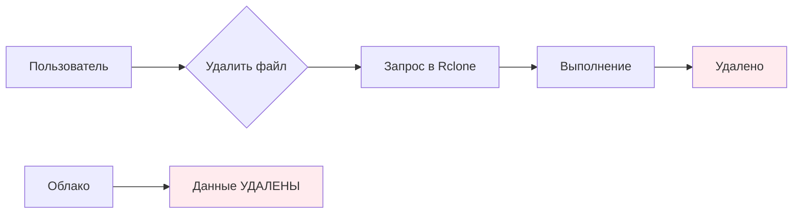
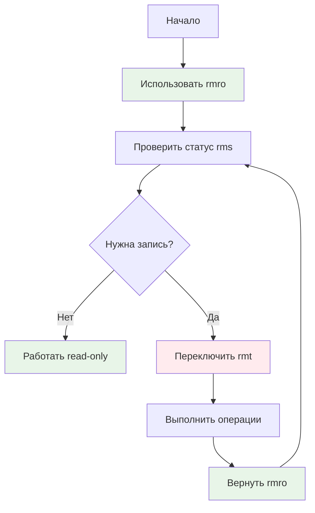

# 🔒 Безопасность данных в Rclone Manager

## ⚠️ Критическая проблема

**При удалении файлов из смонтированных облачных дисков они удаляются напрямую из облака без возможности восстановления!**

Это происходит потому, что rclone mount работает как виртуальная файловая система, и операции удаления передаются напрямую в API облака. **Корзины нет!**

## 🛡️ Режимы работы с облачными дисками

### Read-only (безопасно)


### Read-write (опасно)


## 🎯 Workflow переключения режимов 




## 🎯 Золотые правила безопасности

### Правило 1: Всегда начинайте с read-only
```bash
# ✅ Правильно
rmro              # Подключить все облака в безопасном режиме
rms               # Проверить статус

# ❌ Неправильно
rmrw              # Не делайте так без необходимости
```

### Правило 2: Проверяйте статус перед каждой операцией
```bash
rms               # Всегда проверяйте перед важными операциями
```

### Правило 3: Переключайтесь только когда нужно
```bash
# Рабочий поток:
rmro              # 1. Начать с безопасного режима
rms               # 2. Проверить статус
rmt yandex_disk   # 3. Переключить ТОЛЬКО если нужно редактировать
# ... редактировать ...
rmt yandex_disk   # 4. Вернуть в безопасный режим
rms               # 5. Проверить что вернулись
```

### Правило 4: Немедленно возвращайтесь в read-only
```bash
# После завершения работы с записью
rmt yandex_disk   # Вернуть в read-only
```

---

## 🛡️ Безопасные сценарии

### Сценарий 1: Только чтение (100% безопасно)
```bash
rmro
rms
ls ~/mnt/yandex_disk
cp ~/mnt/yandex_disk/important.txt ~/Documents/
# Готово! Никаких рисков
```

### Сценарий 2: Чтение + запись (контролируемый риск)
```bash
# 1. Подготовка
rmro
rms

# 2. Проверка перед записью
echo "Текущий режим: $(rms yandex_disk)"

# 3. Переключение (только если точно нужно)
rmt yandex_disk

# 4. Работа с записью
nano ~/mnt/yandex_disk/file.txt
rm ~/mnt/yandex_disk/temp.txt

# 5. Возврат в безопасный режим
rmt yandex_disk

# 6. Проверка
rms yandex_disk  # Должно показать read-only
```

### Сценарий 3: Массовые операции (с повышенной осторожностью)
```bash
# Подключение всех облаков
rmro
rms

# Если нужно редактировать во всех - переключаем все
rmrw
rms

# Работа...

# Возврат в безопасный режим
rmro
rms
```

---

## 🚨 Что НЕ делать

### ❌ Критические ошибки

```bash
# ❌ НИКОГДА не делайте так:
rm -rf ~/mnt/yandex_disk/важная_папка
# В read-write режиме = УДАЛЕНИЕ ИЗ ОБЛАКА БЕЗ КОРЗИНЫ!

# ❌ НИКОГДА не запускайте без проверки:
rmrw              # Без необходимости
# Пользователь может случайно удалить файлы

# ❌ НИКОГДА не игнорируйте статус:
# Перед важной операцией всегда проверяйте:
rms
```

### ❌ Опасные паттерны

```bash
# Опасно: массовое удаление
rm -rf ~/mnt/*

# Опасно: синхронизация без проверки
rclone sync ~/local ~/mnt/remote

# Опасно: неизвестный режим
# Всегда проверяйте перед операциями!
```

---

## ✅ Чек-лист безопасности

Перед каждой сессией работы:

- [ ] **Проверьте режим**: `rms`
- [ ] **Если нужна запись**: переключили и снова проверили
- [ ] **После записи**: вернули в read-only
- [ ] **Финальная проверка**: `rms` показывает read-only

Перед опасными операциями:

- [ ] **Что я хочу сделать?**
- [ ] **Какой режим нужен?**
- [ ] **Как вернуться в безопасный режим?**
- [ ] **Есть ли бэкап?**

---

## 📊 Сравнение режимов

| Операция | Read-only | Read-write |
|----------|-----------|------------|
| Просмотр файлов | ✅ | ✅ |
| Копирование файлов | ✅ | ✅ |
| Чтение файлов | ✅ | ✅ |
| Запись в файлы | ❌ | ✅ |
| Создание файлов | ❌ | ✅ |
| Удаление файлов | ❌ | ✅ (удаляет из облака!) |
| Переименование | ❌ | ✅ |

---

## 🆘 Что делать, если...

### Случайно переключил в read-write?
```bash
# 1. Немедленно вернитесь в read-only
rmt yandex_disk

# 2. Проверьте что не удалили ничего важного
ls ~/mnt/yandex_disk

# 3. Если удалили - проверьте облако через веб-интерфейс
# (восстановление возможно только если облако поддерживает корзину)
```

### Не помните в каком режиме?
```bash
rms               # Покажет текущий режим
```

### Нужно срочно остановить все?
```bash
rmstop            # Остановить все облака
```

---

## 🔄 Безопасные алиасы

Добавьте в `~/.bashrc` для быстрого доступа:

```bash
# Безопасные команды (всегда используйте их)
alias safe_read='rmro && rms'      # Подключить и проверить
alias safe_check='rms'             # Быстрая проверка
alias safe_stop='rmstop'           # Остановить все

# Для записи (используйте осознанно)
alias edit_mode='rmt && rms'       # Переключить и проверить
```

---

## 📋 Памятка для новичков

**Запомните 3 команды:**

1. `rmro` - безопасный режим (всегда начинайте с этого)
2. `rms` - проверка статуса (используйте часто)
3. `rmstop` - остановка (если что-то пошло не так)

**Запомните 1 правило:**

> **После любой операции с записью немедленно возвращайтесь в read-only!**

---

## 🎓 Дополнительные ресурсы

- [Быстрый старт](Быстрый%20старт.md) - Пошаговая установка
- [Системные сервисы](Системные%20сервисы.md) - Настройка systemd
- [Готовые сценарии](../examples/usage_examples.md) - Безопасные примеры
- [Параметры VFS](Параметры%20VFS.md) - Технические детали

---

**Главное правило: Если сомневаетесь - используйте read-only!** 🔒