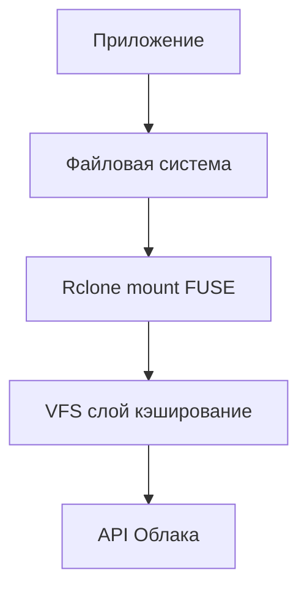
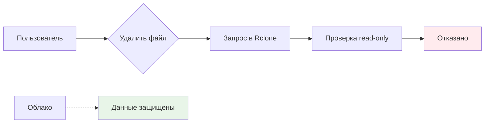
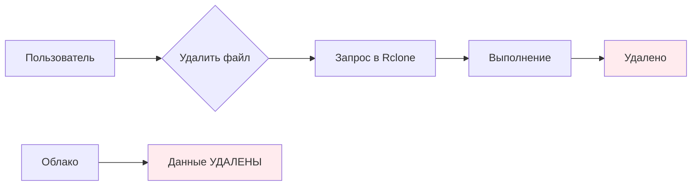
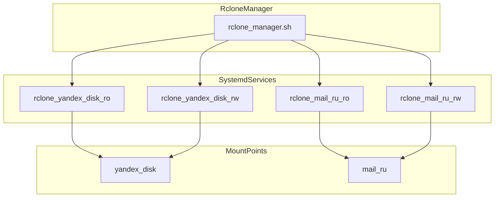
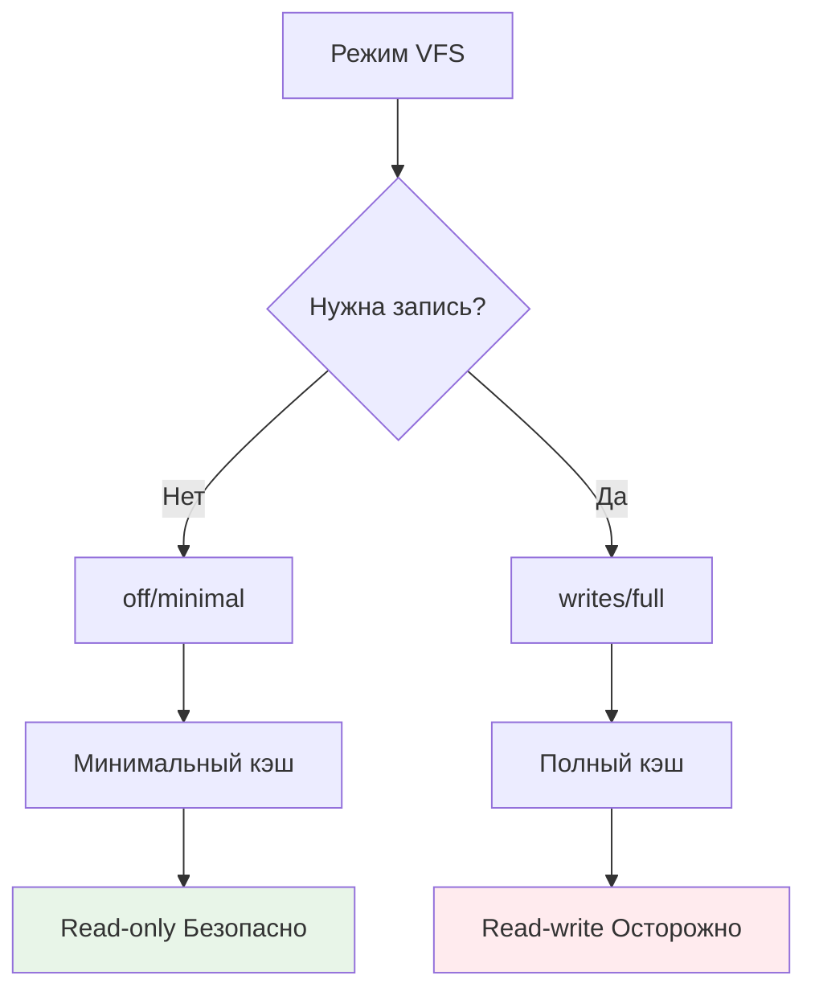
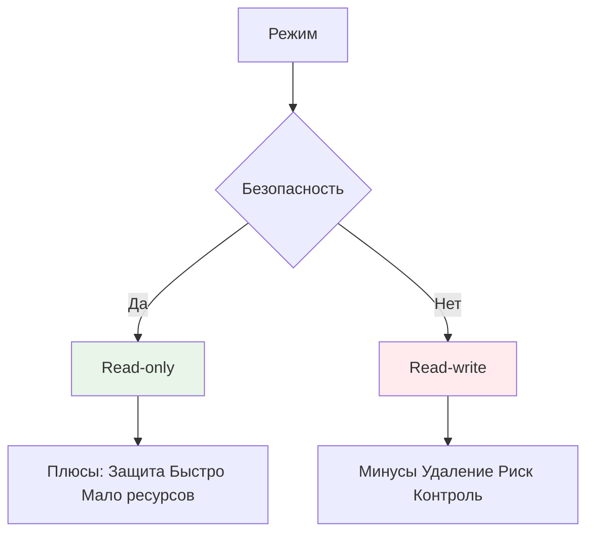
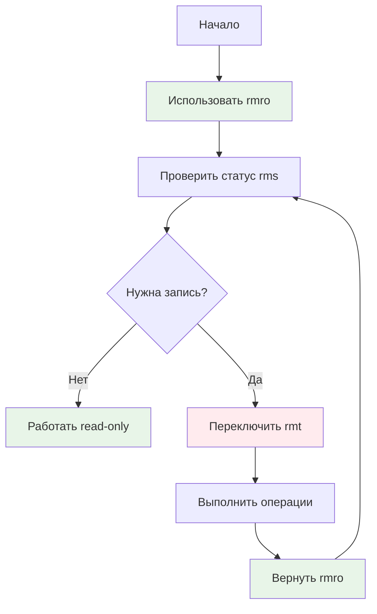
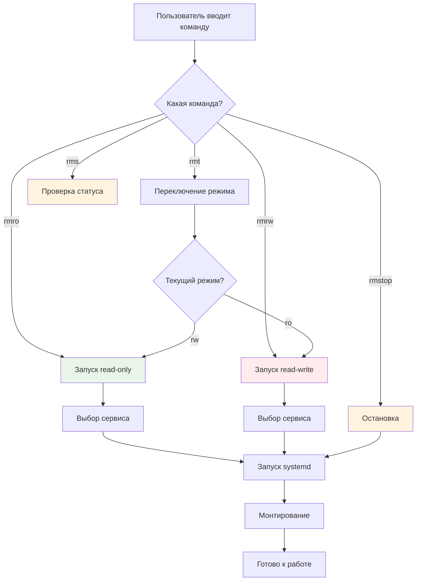
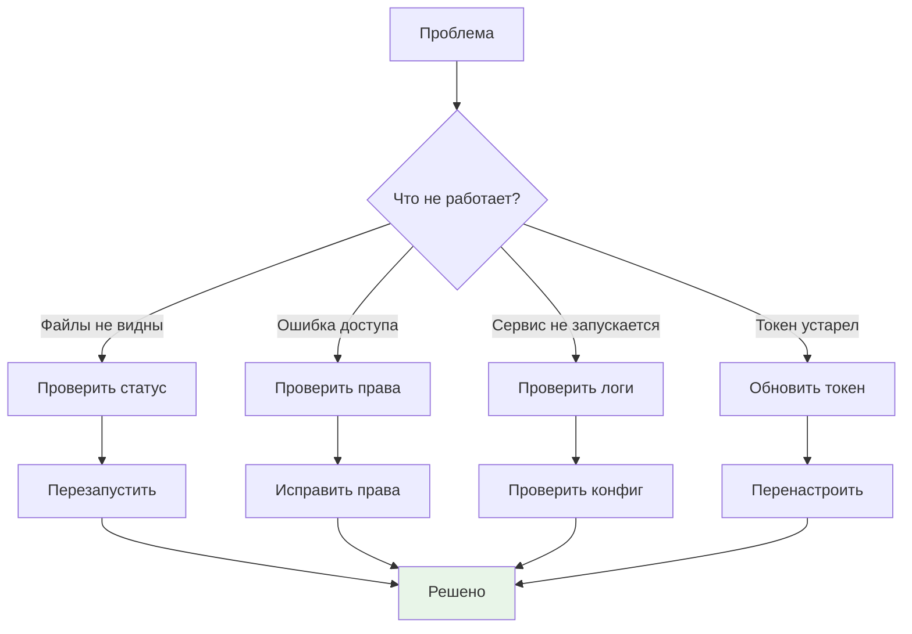

# 📊 Визуализация концепций Rclone Manager

## 🔄 Как работает rclone mount

**Пояснение:**
1. **Приложение** работает с файлами как с обычными
2. **Файловая система** - виртуальная директория в /mnt/
3. **Rclone mount** - мост между файловой системой и облаком
4. **VFS слой** - кэширует данные для производительности
5. **API Облака** - реальное хранилище данных

---

## 🛡️ Безопасность режимов

### Read-only (безопасно)

### Read-write (опасно)

---

## 🏗️ Структура сервисов

---

## ⚙️ Параметры VFS

---

## 📊 Сравнение режимов

---

## 🎯 Правила безопасности

---

## 🔄 Диаграмма работы команд

---

## 📞 Поток отладки

