# 📊 Визуализация концепций Rclone Manager

## 🔄 Как работает rclone mount

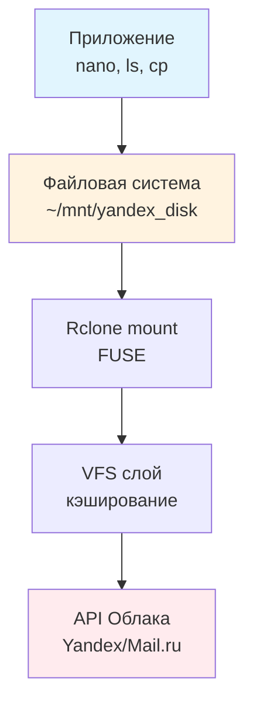
```mermaid
graph TD
    A[Приложение<br/>nano, ls, cp] --> B[Файловая система<br/>~/mnt/yandex_disk]
    B --> C[Rclone mount<br/>FUSE]
    C --> D[VFS слой<br/>кэширование]
    D --> E[API Облака<br/>Yandex/Mail.ru]
    
    style A fill:#e1f5fe
    style B fill:#fff3e0
    style E fill:#ffebee
```

**Пояснение:**
1. **Приложение** работает с файлами как с обычными
2. **Файловая система** - виртуальная директория в `~/mnt/`
3. **Rclone mount** - мост между файловой системой и облаком
4. **VFS слой** - кэширует данные для производительности
5. **API Облака** - реальное хранилище данных

---

## 🛡️ Безопасность режимов

### Read-only (безопасно)
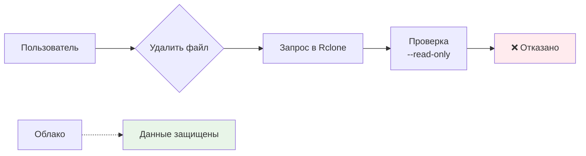
```mermaid
graph LR
    A[Пользователь] --> B{Удалить файл}
    B --> C[Запрос в Rclone]
    C --> D[Проверка<br/>--read-only]
    D --> E[❌ Отказано]
    F[Облако] -.-> G[Данные защищены]
    
    style E fill:#ffebee
    style G fill:#e8f5e8
```

### Read-write (опасно)
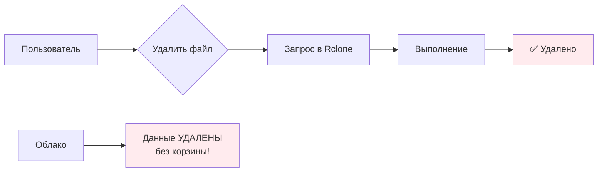
```mermaid
graph LR
    A[Пользователь] --> B{Удалить файл}
    B --> C[Запрос в Rclone]
    C --> D[Выполнение]
    D --> E[✅ Удалено]
    F[Облако] --> G[Данные УДАЛЕНЫ<br/>без корзины!]
    
    style E fill:#ffebee
    style G fill:#ffebee
```

---

## 🏗️ Структура сервисов

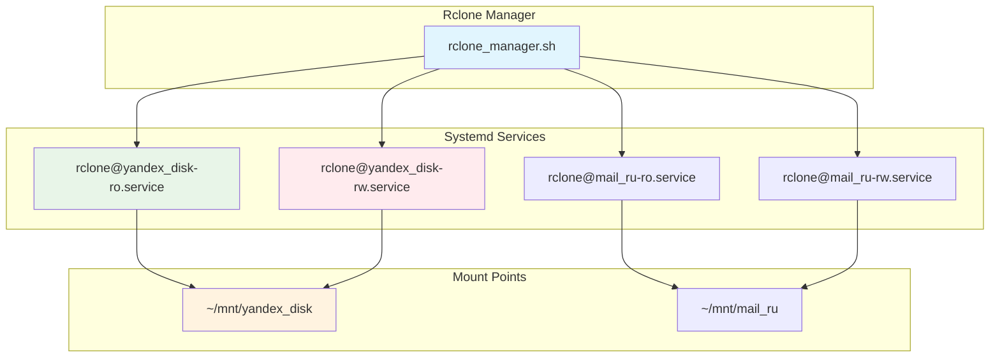
```mermaid
graph TB
    subgraph "Rclone Manager"
        A[rclone_manager.sh]
    end
    
    subgraph "Systemd Services"
        B["rclone@yandex_disk-ro.service"]
        C["rclone@yandex_disk-rw.service"]
        D["rclone@mail_ru-ro.service"]
        E["rclone@mail_ru-rw.service"]
    end
    
    subgraph "Mount Points"
        F["~/mnt/yandex_disk"]
        G["~/mnt/mail_ru"]
    end
    
    A --> B
    A --> C
    A --> D
    A --> E
    
    B --> F
    C --> F
    D --> G
    E --> G
    
    style A fill:#e1f5fe
    style B fill:#e8f5e8
    style C fill:#ffebee
    style F fill:#fff3e0
```

---

## 🔄 Рабочий поток безопасности

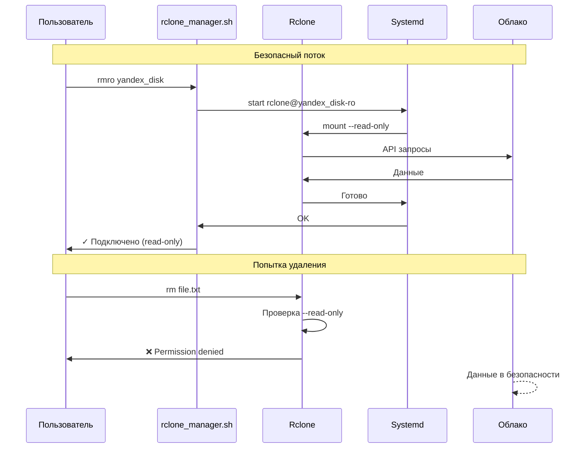
```mermaid
sequenceDiagram
    participant U as Пользователь
    participant S as rclone_manager.sh
    participant R as Rclone
    participant C as Systemd
    participant O as Облако
    
    Note over U,O: Безопасный поток
    
    U->>S: rmro yandex_disk
    S->>C: start rclone@yandex_disk-ro
    C->>R: mount --read-only
    R->>O: API запросы
    O->>R: Данные
    R->>C: Готово
    C->>S: OK
    S->>U: ✓ Подключено (read-only)
    
    Note over U,O: Попытка удаления
    U->>R: rm file.txt
    R->>R: Проверка --read-only
    R->>U: ❌ Permission denied
    O-->>O: Данные в безопасности
```

---

## ⚙️ Параметры VFS

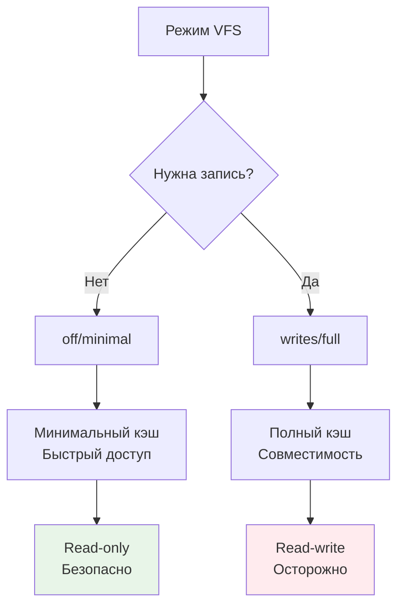
```mermaid
graph TD
    A[Режим VFS] --> B{Нужна запись?}
    B -->|Нет| C[off/minimal]
    B -->|Да| D[writes/full]
    
    C --> E[Минимальный кэш<br/>Быстрый доступ]
    D --> F[Полный кэш<br/>Совместимость]
    
    E --> G[Read-only<br/>Безопасно]
    F --> H[Read-write<br/>Осторожно]
    
    style G fill:#e8f5e8
    style H fill:#ffebee
```

---

## 📊 Сравнение режимов

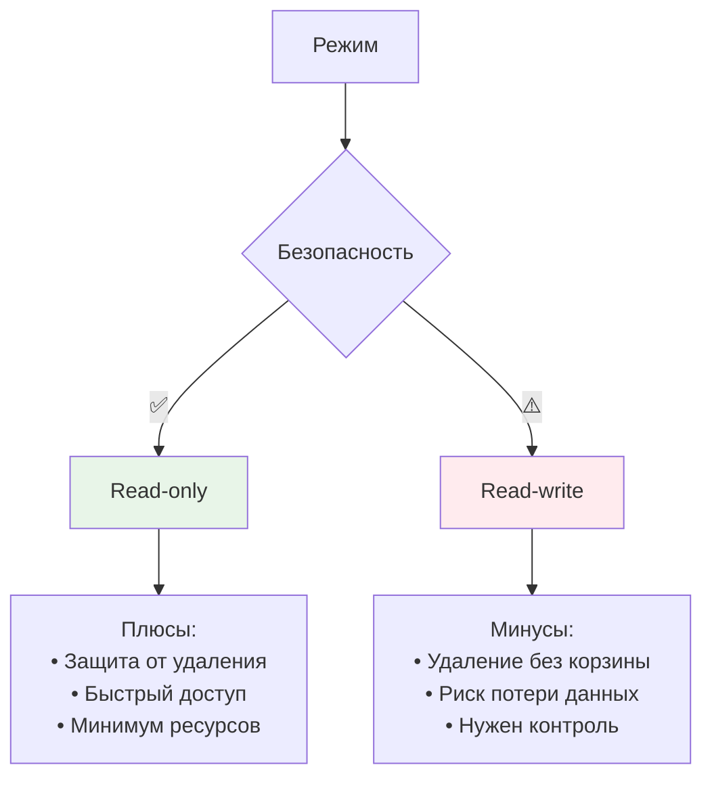
```mermaid
graph TD
    A[Режим] --> B{Безопасность}
    B -->|✅| C[Read-only]
    B -->|⚠️| D[Read-write]
    
    C --> E[Плюсы:<br/>• Защита от удаления<br/>• Быстрый доступ<br/>• Минимум ресурсов]
    D --> F[Минусы:<br/>• Удаление без корзины<br/>• Риск потери данных<br/>• Нужен контроль]
    
    style C fill:#e8f5e8
    style D fill:#ffebee
```

---

## 🎯 Правила безопасности

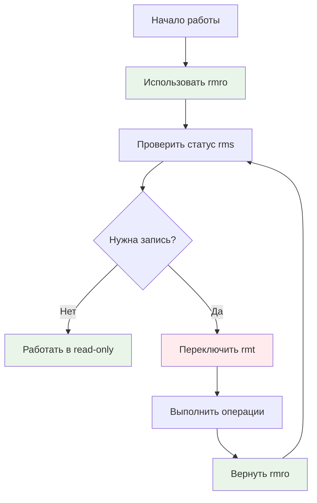
```mermaid
graph TD
    A[Начало работы] --> B[Использовать rmro]
    B --> C[Проверить статус rms]
    C --> D{Нужна запись?}
    D -->|Нет| E[Работать в read-only]
    D -->|Да| F[Переключить rmt]
    F --> G[Выполнить операции]
    G --> H[Вернуть rmro]
    H --> C
    
    style B fill:#e8f5e8
    style E fill:#e8f5e8
    style F fill:#ffebee
    style H fill:#e8f5e8
```

---

## 📁 Структура проекта

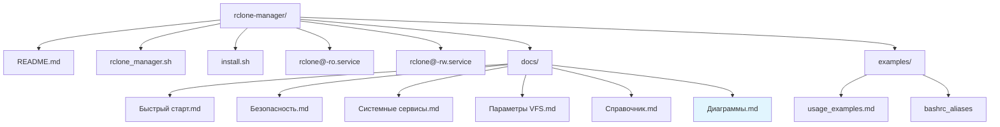
```mermaid
graph TB
    P[rclone-manager/]
    
    P --> F1[README.md]
    P --> F2[rclone_manager.sh]
    P --> F3[install.sh]
    P --> F4["rclone@-ro.service"]
    P --> F5["rclone@-rw.service"]
    
    P --> D[docs/]
    D --> D1[Быстрый старт.md]
    D --> D2[Безопасность.md]
    D --> D3[Системные сервисы.md]
    D --> D4[Параметры VFS.md]
    D --> D5[Справочник.md]
    D --> D6[Диаграммы.md]
    
    P --> E[examples/]
    E --> E1[usage_examples.md]
    E --> E2[bashrc_aliases]
    
    style D6 fill:#e1f5fe
```

---

## 🔄 Диаграмма работы команд

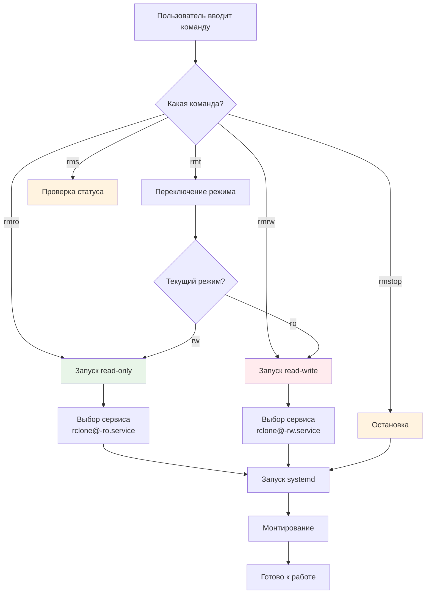
```mermaid
flowchart TD
    A[Пользователь вводит команду] --> B{Какая команда?}
    
    B -->|rmro| C[Запуск read-only]
    B -->|rmrw| D[Запуск read-write]
    B -->|rmt| E[Переключение режима]
    B -->|rms| F[Проверка статуса]
    B -->|rmstop| G[Остановка]
    
    C --> H[Выбор сервиса<br/>rclone@-ro.service]
    D --> I[Выбор сервиса<br/>rclone@-rw.service]
    E --> J{Текущий режим?}
    J -->|ro| D
    J -->|rw| C
    
    H --> K[Запуск systemd]
    I --> K
    G --> K
    
    K --> L[Монтирование]
    L --> M[Готово к работе]
    
    style C fill:#e8f5e8
    style D fill:#ffebee
    style F fill:#fff3e0
    style G fill:#fff3e0
```

---

## 📞 Поток отладки

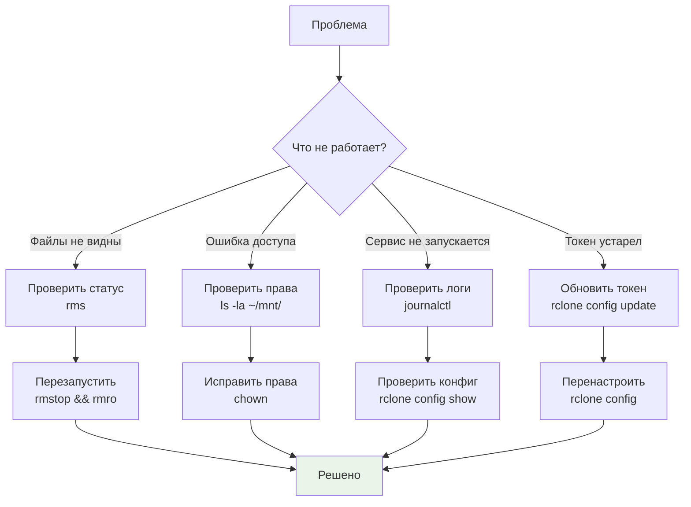
```mermaid
graph TD
    A[Проблема] --> B{Что не работает?}
    
    B -->|Файлы не видны| C[Проверить статус<br/>rms]
    B -->|Ошибка доступа| D[Проверить права<br/>ls -la ~/mnt/]
    B -->|Сервис не запускается| E[Проверить логи<br/>journalctl]
    B -->|Токен устарел| F[Обновить токен<br/>rclone config update]
    
    C --> G[Перезапустить<br/>rmstop && rmro]
    D --> H[Исправить права<br/>chown]
    E --> I[Проверить конфиг<br/>rclone config show]
    F --> J[Перенастроить<br/>rclone config]
    
    G --> K[Решено]
    H --> K
    I --> K
    J --> K
    
    style K fill:#e8f5e8
```

---

**Примечание:** Для просмотра диаграмм в VS Code установите расширение "Markdown Preview Mermaid Support" или используйте онлайн редактор Mermaid.